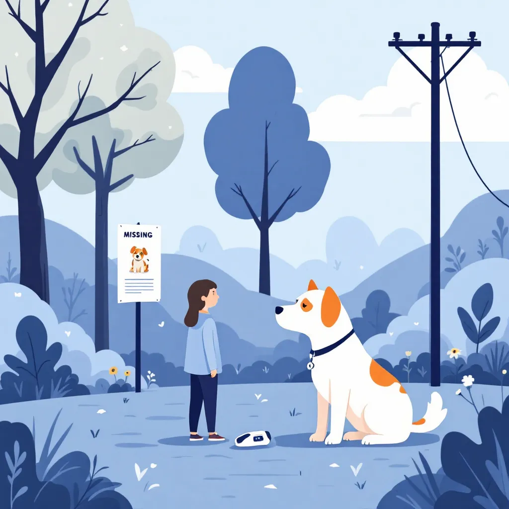

# 🐾 Dijital Pati - Kayıp & Sahiplendirme Platformu



**Dijital Pati**, kayıp evcil hayvanların bulunmasını kolaylaştıran, sahiplendirme ilanlarını yöneten ve hayvanseverleri bir araya getiren modern bir **Full-Stack** web uygulamasıdır.

Performans, erişilebilirlik ve kullanıcı deneyimi (UX) odaklı geliştirilmiştir. **Next.js 15 (App Router)** mimarisi üzerine inşa edilmiştir.

## 🚀 Canlı Demo
[https://dijital-pati.vercel.app](https://dijital-pati.vercel.app)

---

## 🛠️ Teknolojiler ve Mimari

Bu proje, modern web standartlarına uygun olarak en güncel teknolojilerle geliştirilmiştir:

- **Frontend:** Next.js 15 (App Router), React, TypeScript, Tailwind CSS
- **Backend (BaaS):** Supabase (PostgreSQL, Auth, Storage, Realtime)
- **Veri Yönetimi:** Server Actions (API routes olmadan doğrudan veri mutasyonu)
- **Harita & Konum:** Google Maps API Entegrasyonu
- **Deploy:** Vercel

---

## ⚡ Performans Optimizasyonları (Web Performance)

Bu proje sadece çalışmakla kalmaz, **uçar**. Geliştirme sürecinde **Google PageSpeed Insights** metriklerine (Core Web Vitals) sadık kalınarak ciddi optimizasyonlar yapılmıştır:

### 1. 🟢 Mobil Performans Skoru: 90+
- **LCP (Largest Contentful Paint):** Görseller WebP formatına dönüştürüldü, `next/image` ile responsive boyutlandırma (sizes prop) yapıldı.
- **CLS (Cumulative Layout Shift):** **0 (Sıfır).** Statik importlar ve Skeleton yükleme ekranları ile düzen kaymaları tamamen engellendi.
- **TTFB (Time to First Byte):** Veritabanı seviyesindeki saat dilimi sorguları optimize edilerek sunucu yanıt süresi **1.5 saniyeden <200ms** seviyesine düşürüldü.

### 2. 🏗️ Mimari İyileştirmeler
- **Code Splitting & Lazy Loading:** Ana sayfa ve ağır bileşenler (Footer, Modals) `next/dynamic` ile parçalandı. Kullanılmayan JavaScript kodu (Tree-shaking) temizlendi.
- **Client/Server Component Ayrımı:** `ssr: false` gerektiren kütüphaneler (Toaster, Analytics) izole edilerek sunucu yükü hafifletildi.
- **Caching:** `unstable_cache` ve Vercel Edge Caching stratejileri uygulandı.

---

## ✨ Öne Çıkan Özellikler

- **📍 Konum Bazlı Bildirim:** Kayıp bir hayvan görüldüğünde, harita üzerinden konum işaretlenerek sahibine "Müjde" bildirimi ve e-posta gönderilir.
- **🔐 Güvenli Kimlik Doğrulama:** Supabase Auth ile güvenli giriş/kayıt işlemleri.
- **📱 Responsive Tasarım:** Mobilden masaüstüne kusursuz görünüm.
- **🔔 Gerçek Zamanlı Bildirimler:** Site içi bildirim sistemi.
- **🖼️ Görsel Optimizasyonu:** Kullanıcıların yüklediği fotoğraflar optimize edilerek saklanır.

---

## 📦 Kurulum ve Çalıştırma

Projeyi yerel ortamınızda çalıştırmak için:

1. **Repoyu klonlayın:**
   ```bash
   git clone [Repo Linki Buraya Gelecek]
   cd dijital-pati
   ```

2. **Frontend bağımlılıklarını yükleyin:**
   ```bash
   cd frontend
   npm install
   ```

3. **Ortam değişkenlerini ayarlayın:**  
   `frontend` klasöründe `.env.local` dosyası oluşturup Supabase ve gerekli API anahtarlarını ekleyin.

4. **Geliştirme sunucusunu başlatın:**
   ```bash
   npm run dev
   ```
   Uygulama [http://localhost:3000](http://localhost:3000) adresinde çalışacaktır.
